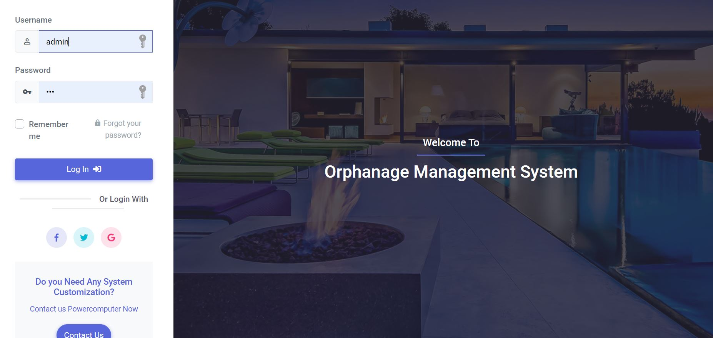
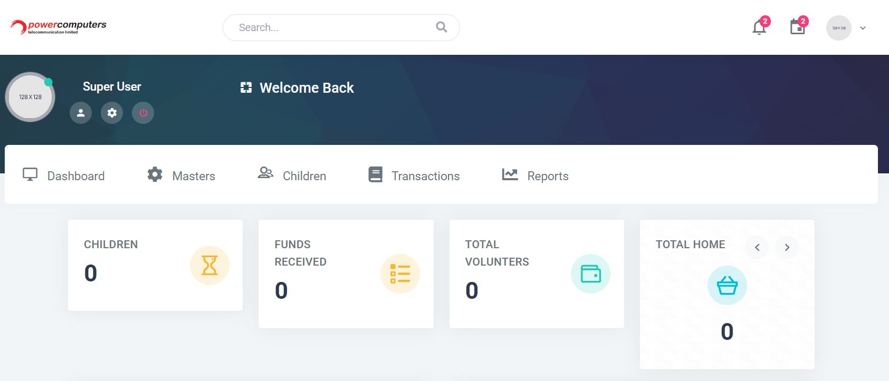
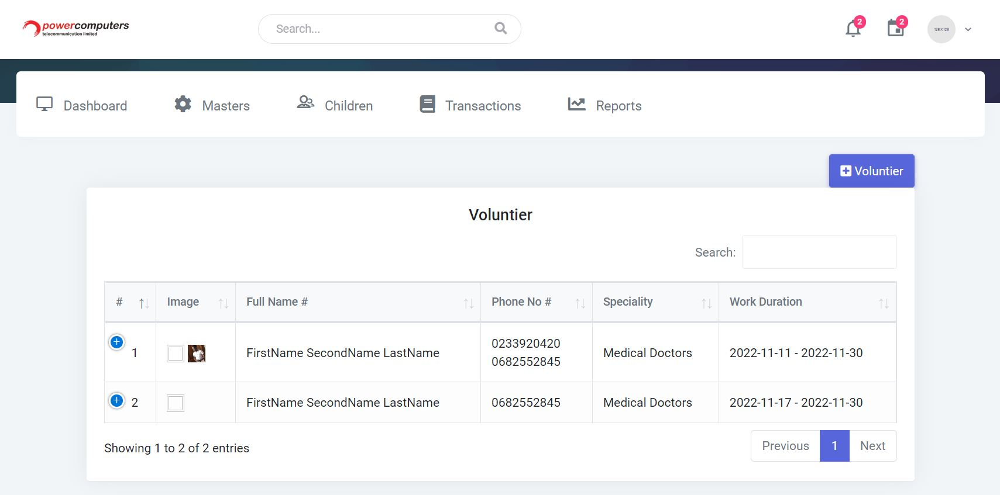
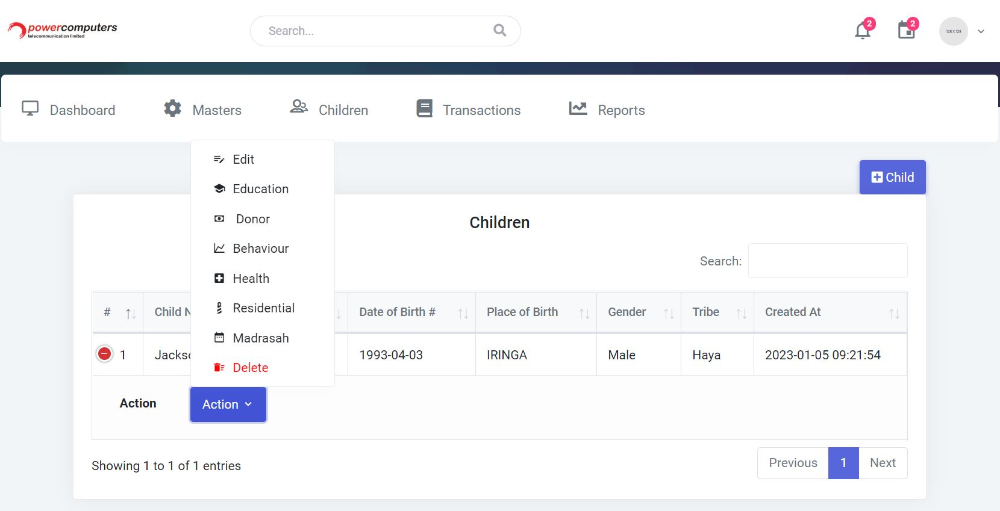
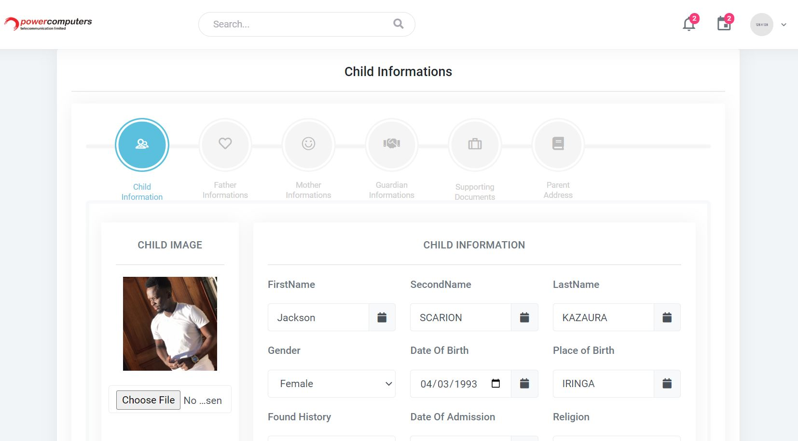

# Orphanage
Orphanage Home Management System (OHMS) is designed mostly for orphanage home centers to achieve and track the orphan registration, education details, donors and volunteers information and maintenance.

# Installation Guides
The Project was written using plain php language and MYSQL for managing DATA 
So to install it Download Xampp and install it in your computer then clone the project and paste it to HTDOCS directory from Xampp then start apache and mysql from xampp service. Import database located from database folder of project to mysql DBMS. After doing that access the project using locahost/orphage

Remember to Install Composer and node for PHP and Javascript package installation

# Login Screen

# Dashboard

# Volunteer Information

# Child Details

# Child Registration

